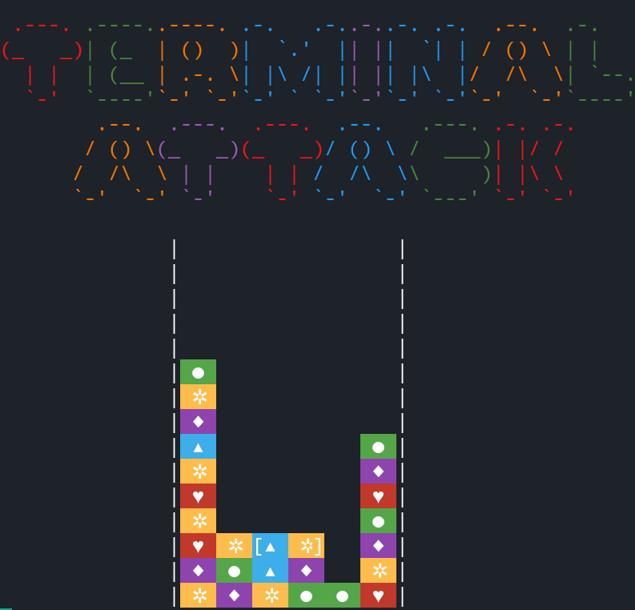

# Tetris Terminal Attack
## It started as a base for a non-terminal game, but I got a bit excited :laughing:



### Dependencies
It only has the `readchar` dependency, install it by using:
```sh
pip install readchar
```

### How to run
Run it by using
```
python play.py
```

### How to play
 - <kbd>Arrows</kbd> to move
 - <kbd>Space</kbd> to swap
